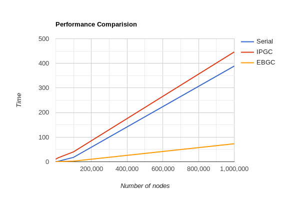
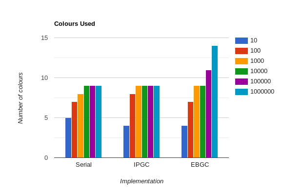

# Parallel-Graph-Colouring-Algorithms
This repository contains all the work that is done under this project

## Log

The following methods have been implemented in CUDA:
- [Vertex Based Iterative PGC](./CUDA/IPGC.cu) (IPGC)  
    It is a simple approach in which the vertices are colored speculatively, and conflicts that occur due to race conditions are detected. The above steps are repeated until there are no conflicts.
- [Edge Based PGC](./CUDA/EBGC.cu) (EBGC)  
    For each vertex v, VFORBIDDEN(v) holds the list of forbidden colors for v. First the algorithm goes through all vertices and picks the smallest available color for v based on VFORBIDDEN(v). Then conflicts are detected by going through all edges and checking if any two endpoints have the same color. If so, one endpoint is marked with conflict. Then VFORBIDDEN(v) is atomically based on colors of neighbours of v, updated by going through all edges. The algorithm terminates when there are no conflicts. The above steps are repeated until there are no conflicts.

## Generating random graphs

[random_graph_gen.cpp](./random_graph_gen.cpp) takes in number of nodes and edges as input and generates random graphs. Following are the commands to generate a random graph with 100 nodes and 500 edges.

```
$ g++ random_graph_gen.cpp -o rgg.out 
$ ./rgg.out sample_graph.in
Enter number of vertices : 100
Enter number of egdes    : 500 
```

## Running the serial code

Fire up the terminal and type in the following commands to run the serial graph coloring algorithm on sample_graph.in

```
$ g++ serial.cpp -std=c++11 -o serial.out
$ ./serial.out sample_graph.in
```

## Analysis

Following the comparison of serial, IPGC and EBGC algorithms. The input graphs analysed are generated from [random_graph_gen.cpp](./random_graph_gen.cpp). The number of edges is five times the number of nodes.




